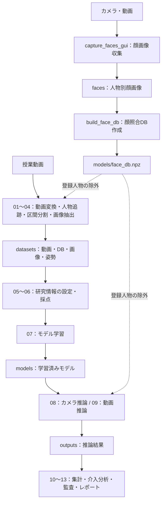

# プロジェクト構成ガイド

確認日: 2026年9月29日
対象: D:\MyProjects\python_projects\ConcentrationMeasurement\ConcentrationMeasurement

授業動画から集中度（映像から観察できる授業課題への従事度）を推定・分析するPythonプロジェクトです。
大量の動画・画像、実行環境の内部ファイルは省略しています。
<データセット名>、<人物名>は実際のフォルダ名に置き換わる表記です。

## 全体の構成

```text
ConcentrationMeasurement/
├── launcher.py                    # データセット選択・ラベリング起動用GUI
├── launch_labeler.bat              # Windows用の起動バッチ
├── config.yaml                    # 動画処理・検出・姿勢推定・顔除外の設定
├── README.md                      # 開発環境の導入手順
├── requirements.txt               # Windows向け依存パッケージ
├── requirements_for_mac.txt       # Mac向け依存パッケージ
│
├── scripts/                       # 処理プログラム本体（後述）
├── tests/                         # 自動テスト
├── docs/                          # 操作・分析ドキュメント
│
├── inputs/                        # 推論などに使用する入力動画
├── datasets/                      # 授業ごとの学習・採点用データ
│   └── <データセット名>/
│       ├── videos/                # 元動画・処理用動画・ID表示付き動画
│       ├── db/                    # 検出結果・区間・ラベルなどのSQLite DB
│       └── assets/                # 人物切り抜き画像・姿勢データ
├── faces/                         # 顔照合用の人物別画像
│   └── <人物名>/                  # 収集した顔画像の保存先
├── models/                        # 学習済みモデル・顔照合DB
│   ├── face_db.npz                # 登録人物の顔特徴量
│   ├── gru_sample.pt              # GRUモデルのチェックポイント
│   ├── yolov8n.pt                 # 軽量な人物検出モデル
│   ├── yolov8x.pt                 # 大規模な人物検出モデル
│   ├── yolov8n-pose.pt            # 軽量な姿勢推定モデル
│   └── yolov8x-pose.pt            # 大規模な姿勢推定モデル
├── outputs/                       # 推論結果・集計・レポートの保存先
│
├── ffmpeg/                        # 動画変換用ツール
├── WPy64-312101/                   # 同梱のWindows用Python環境
├── .venv/                         # Python仮想環境
├── .git/                          # Gitの変更履歴・管理情報
├── .gitignore                     # Git管理から除外する対象
├── .gitattributes                 # Gitのファイル取り扱い設定
├── .idea/                         # IDEのプロジェクト設定
├── ConcentrationMeasurement.iml   # IDE用のモジュール設定
│
├── commands.txt                   # 実行コマンドのメモ
├── time_required.txt              # 処理時間の記録
├── part-time_job_assignment.txt   # 採点作業の担当割り当て
└── mei_kara_mei_switch1.wav        # 処理完了の通知音
```

## プログラムの構成

番号付きファイルは、前処理から分析までの主要な処理を担当します。
libは共通処理、toolsは補助ツールです。

```text
scripts/
├── 01_make_proxy.py                    # 元動画から処理用proxy動画を作成
├── 02_detect_track.py                  # 人物検出・追跡、人物ID付き動画を作成
├── 03_make_segments.py                 # 動画を時間区間・人物別区間に分割
├── 04_extract_frames_assets.py         # 人物画像と姿勢データを抽出
├── 05_configure_research_dataset.py     # 学校・学年などの研究情報を設定
├── 06_label_gui.py                     # 授業状況・集中度を採点するGUI
├── 07_train.py                         # 集中度などの推定モデルを学習
├── 08_realtime.py                      # カメラ映像をリアルタイムに推論
├── 09_video_offline.py                 # 保存済み動画を推論
├── 10_aggregate_predictions.py         # 推論結果を時間単位などで集計
├── 11_intervention_analysis.py         # 介入効果の分析
├── 12_measurement_invariance_audit.py   # 測定不変性の監査・検証
├── 13_ab_intervention_report.py        # AB前後の比較レポートを作成
│
├── lib/                               # 各スクリプトで共有する機能
│   ├── db.py                          # データベースの定義・操作
│   ├── research_schema.py             # 研究用メタデータ・DB構造の管理
│   ├── video.py                       # 動画情報の取得など
│   ├── proxy_id_video.py              # 人物IDを表示した動画の生成
│   ├── segment.py                     # 時間区間の生成
│   ├── rating_clips.py                # 採点用に連続区間をまとめる処理
│   ├── image_roi.py                   # モデルへ渡す画像領域の取り扱い
│   ├── pose_norm.py                   # 姿勢座標の正規化
│   ├── model_defs.py                  # 画像・姿勢・時系列モデルの定義
│   ├── infer.py                       # 推論用の共通処理
│   ├── seq_buffer.py                  # 人物別の時系列データを保持
│   ├── situation.py                   # 授業状況の取り扱い
│   ├── face_exclusion.py              # 顔照合による登録人物の除外
│   ├── devices.py                     # CPU・CUDA・MPSなどの選択
│   ├── platform_tools.py              # OS別の動画ツール探索
│   ├── runroot.py                     # プロジェクト・データの基準パス管理
│   └── completion_sound.py            # 完了通知音の再生
│
└── tools/                             # 個別作業用の補助ツール
    ├── capture_faces_gui.py            # カメラ・動画から顔画像を収集
    ├── build_face_db.py                # 顔画像から照合用DBを作成
    ├── build_proxy_id_video.py         # 保存済み検出結果からID付き動画を作成
    ├── build_labeling_package.py       # 採点作業用の配布パッケージを作成
    ├── merge_rater_databases.py        # 複数評価者の採点DBを統合
    ├── migrate_windows_schema.py      # 時間区間に関するDB構造を移行
    ├── evaluate_labeled_dataset.py    # ラベル付きデータでモデルを評価
    ├── apply_ab_interval.py           # AB実施区間を推論DBへ登録
    └── make_situation_bg_chart.py     # 授業状況を背景色で示すグラフを作成
```

ABは「アクティブ・ブレイク」を指します。

## ドキュメントとテスト

```text
docs/
├── PROJECT_STRUCTURE.md           # 本ガイド（Markdown版・Mermaid図付き）
├── PROJECT_STRUCTURE.txt          # 本ガイド（プレーンテキスト版）
├── LABELING_GUIDE.md              # データ準備・状況設定・集中度採点の手順
├── MODEL_WORKFLOW.md              # 学習・評価・推論の手順
├── RESEARCH_ANALYSIS.md           # 研究設計・集計・AB解析の説明
├── METRICS_GUIDE.md               # 評価指標の説明
└── TROUBLESHOOTING.md             # エラーや問題への対処方法

tests/
├── test_face_exclusion.py         # 顔照合による除外処理のテスト
├── test_rating_clips.py           # 採点区間の結合処理のテスト
├── test_research_schema.py        # 研究用DB構造のテスト
├── test_situation_feature_flag.py # 授業状況に関する機能切り替えのテスト
└── test_unlabeled_navigation.py   # 未採点区間への移動処理のテスト
```

## 処理の流れ

```text
授業動画
  ↓
01〜04：動画変換 → 人物追跡 → 区間分割 → 画像・姿勢抽出
  ↓
datasets/：動画・DB・画像・姿勢
  ↓
05〜06：研究情報の設定・採点
  ↓
07：モデル学習
  ↓
models/：学習済みモデル
  ↓
08：カメラ推論 または 09：動画推論
  ↓
outputs/：推論結果
  ↓
10〜13：集計・介入分析・監査・レポート

顔照合用データの準備：
カメラ・動画 → capture_faces_gui.py → faces/<人物名>/
  → build_face_db.py → models/face_db.npz
  → 画像抽出・推論時に、登録人物を対象から除外するために使用
```

この図は主要なデータの流れを示します。すべてのスクリプトを毎回実行する必要はなく、
研究情報の設定や分析は目的に応じて行います。顔による除外は設定で切り替えられます。

## 処理フロー図（Mermaid対応ビューア用）


